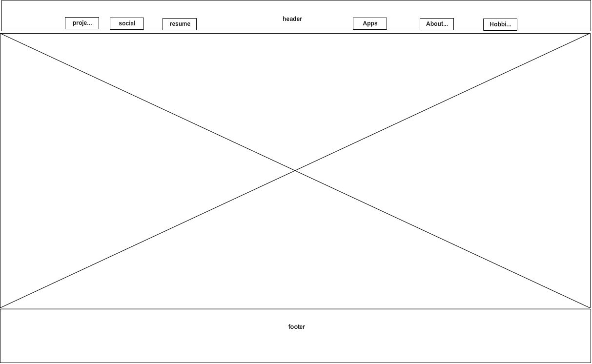

What is a wireframe?
A wireframe is a layout of your sites structure, that is usually based on your site map. It lays out the working parts of the site including the header, footer, navigation, and sometimes where text and images are to be placed, depending on the website.
What are the benefits of wireframing?
The benifits of wireframing are; 1. You get a brief overview of what your site will look like when finished. 2. You get idea if the layout and look of the site meet the users needs and if the iformation necessary will fit within the layout of the site. 
Did you enjoy wireframing your site?
Yes, I did enjoy laying out and wireframing my site.
Did you revise your wireframe or stick with your first idea?
Yes, I did revise a little from my first idea, and I may possibly revise several more times as I get more content to add to the site. 
What questions did you ask during this challenge? What resources did you find to help you answer them?
Most of the questions that I had were answered within the required reading resources. Mostly they were questions about ux, grid and layout. Basically which grid would work best and which software could accomodate a grid layout.
Which parts of the challenge did you enjoy and which parts did you find tedious? I enjoyed all parts of this challenge, even though sorting through the resources for grid software did become a little tedious because there were so many choices.
